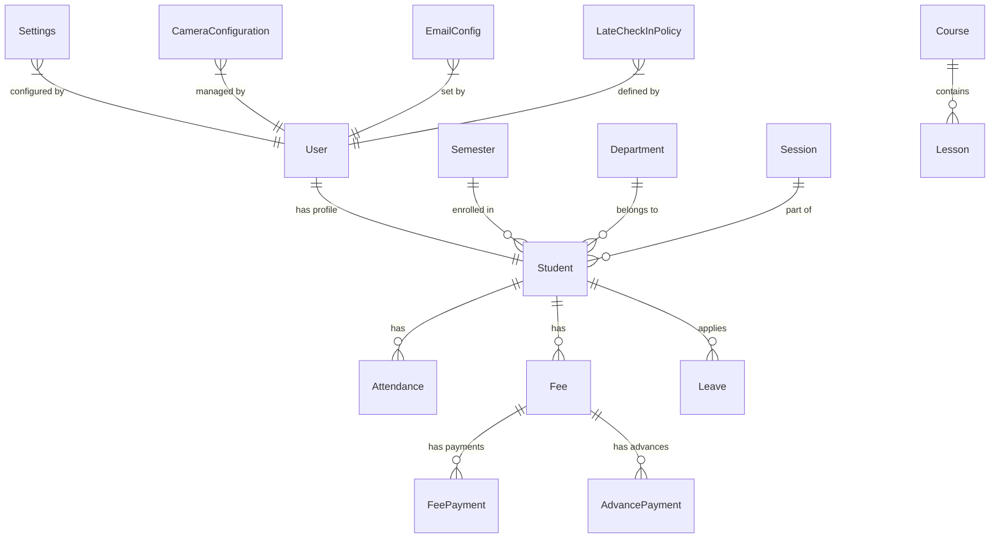
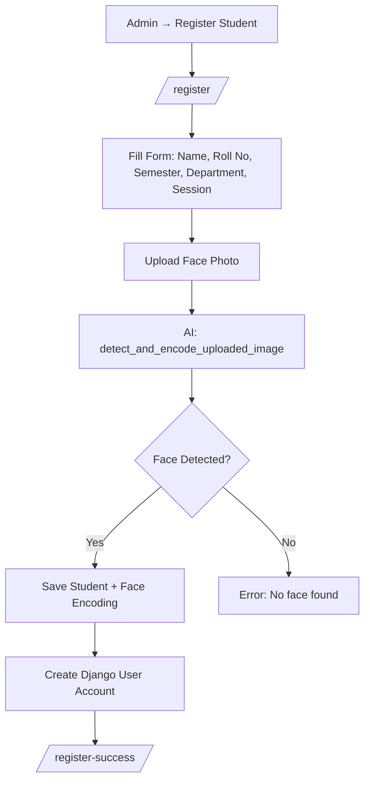
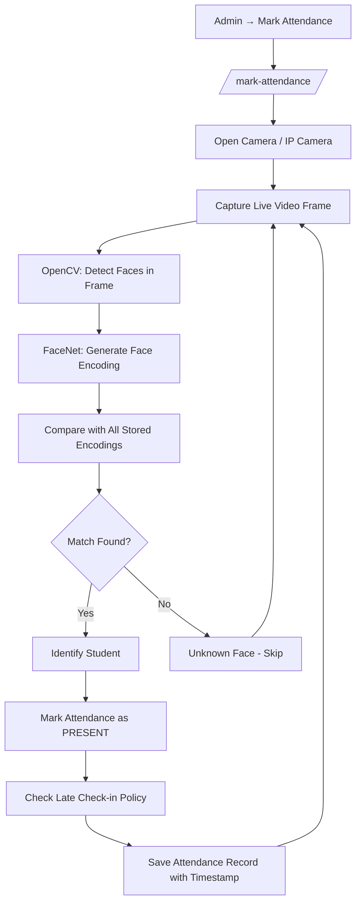
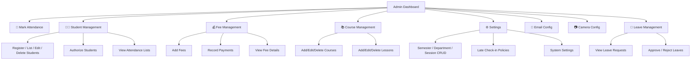
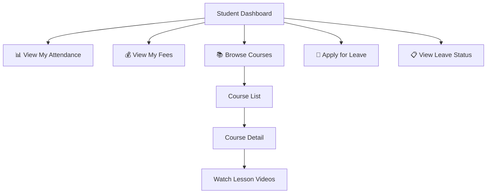
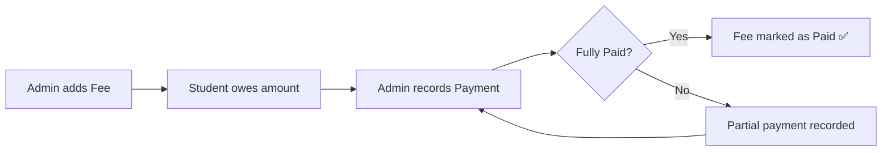
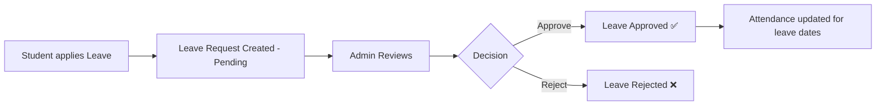

# 🎓 Smart Attendance System — Complete Project Workflow

## 📌 Overview

This is a **Django-based Face Recognition Attendance System** that uses **AI/ML (FaceNet + OpenCV)** to automatically detect and recognize student faces via camera, mark attendance, and manage the entire academic workflow including fees, leaves, courses, and email notifications.

---

## 🏗️ Tech Stack

| Technology | Purpose |
|---|---|
| **Django 5.0.7** | Web framework (Backend + Frontend) |
| **SQLite** | Database |
| **FaceNet (PyTorch)** | Face recognition AI model |
| **OpenCV** | Camera capture & image processing |
| **HTML/CSS/JS** | Frontend templates |
| **Pygame** | Audio/media support |

---

## 🗂️ Project Structure

```
Face-recognition-attandance-system-v3/
├── Project101/          # Django project settings
│   ├── settings.py      # Configuration
│   ├── urls.py          # Root URL routing
│   ├── wsgi.py / asgi.py
├── app1/                # Main application
│   ├── models.py        # 15 Database models
│   ├── views.py         # 60+ view functions
│   ├── urls.py          # All URL routes
│   ├── forms.py         # Django forms
│   ├── admin.py         # Admin panel config
├── templates/           # HTML templates
│   ├── home.html        # Landing page
│   ├── login.html       # Login page
│   ├── Mark_attendance.html
│   ├── register_student.html
│   ├── student/         # Student dashboard
│   ├── camera/          # Camera config
│   ├── courses/         # Course management
│   ├── fee/             # Fee management
│   ├── email/           # Email config
├── media/               # Uploaded student images
├── static/              # CSS, JS, images
├── db.sqlite3           # SQLite database
```

---

## 📊 Database Models (15 Models)



| # | Model | Purpose |
|---|---|---|
| 1 | **Semester** | Academic semesters (1st, 2nd, etc.) |
| 2 | **Department** | Departments (CS, IT, etc.) |
| 3 | **Session** | Academic sessions (2024-25, etc.) |
| 4 | **Course** | Courses with video lessons |
| 5 | **Lesson** | Individual lessons within courses |
| 6 | **Student** | Student profiles with face images |
| 7 | **LateCheckInPolicy** | Late attendance rules |
| 8 | **Attendance** | Daily attendance records |
| 9 | **Fee** | Fee records per student |
| 10 | **FeePayment** | Fee payment transactions |
| 11 | **AdvancePayment** | Advance fee payments |
| 12 | **CameraConfiguration** | IP camera settings |
| 13 | **EmailConfig** | Email notification config |
| 14 | **Settings** | System-wide settings |
| 15 | **Leave** | Student leave applications |

---

## 🔄 Complete Workflow

### 1️⃣ Authentication Flow

```mermaid
flowchart LR
    A[User visits /] --> B[Home Page]
    B --> C[Click Login]
    C --> D[/login/ page]
    D --> E{Credentials Valid?}
    E -->|Yes + Admin| F[Admin Dashboard]
    E -->|Yes + Student| G[Student Dashboard]
    E -->|No| D
    F --> H[Logout → /login/]
    G --> H
```

- **Admin users** (`is_staff=True`) → Redirected to **Admin Dashboard** (`/admin-dashboard/`)
- **Student users** → Redirected to **Student Dashboard** (`/student-dashboard/`)

---

### 2️⃣ Student Registration Flow (Admin)



> [!IMPORTANT]
> During registration, the system uses **FaceNet AI model** to detect the face in the uploaded photo and creates a **face encoding (embedding)** that is stored for later recognition.

---

### 3️⃣ 📸 Face Recognition Attendance Flow (Core Feature)



**Key Functions:**
- `capture_and_recognize()` — Uses webcam
- `capture_and_recognize_with_cam()` — Uses IP camera (RTSP)
- `recognize_faces()` — AI comparison logic
- `detect_and_encode()` — Face encoding generation
- `process_frame()` — Real-time frame processing

> [!NOTE]
> The system supports both **local webcam** and **IP cameras** (configured via Camera Configuration). It runs real-time face detection and matches against all registered students.

---

### 4️⃣ Admin Dashboard Features



---

### 5️⃣ Student Dashboard Features



---

### 6️⃣ Fee Management Flow



---

### 7️⃣ Leave Management Flow



---

## 🔗 All URL Routes

| URL | Function | Access |
|---|---|---|
| `/` | Home page | Public |
| `/login/` | User login | Public |
| `/logout/` | User logout | Authenticated |
| `/admin-dashboard/` | Admin dashboard | Admin |
| `/mark-attendance/` | Face recognition attendance | Admin |
| `/register/` | Register new student | Admin |
| `/student-list/` | List all students | Admin |
| `/student/<id>/` | Student details | Admin |
| `/student-authorize/<id>/` | Authorize student | Admin |
| `/student-dashboard/` | Student dashboard | Student |
| `/student-attendance/` | Student's own attendance | Student |
| `/student-fee-detail/` | Student's own fees | Student |
| `/apply_leave/` | Apply for leave | Student |
| `/Student_leave_list/` | Student's leave list | Student |
| `/courses/` | Course listing | Authenticated |
| `/camera-config/` | Camera settings | Admin |
| `/semesters/` | Manage semesters | Admin |
| `/departments/` | Manage departments | Admin |
| `/sessions/` | Manage sessions | Admin |
| `/settings/` | System settings | Admin |
| `/late-checkin-policies/` | Late policies | Admin |
| `/email-configs/` | Email configuration | Admin |
| `/admin/` | Django admin panel | Superuser |

---

## 🚀 How to Run

```bash
# 1. Install dependencies
pip install -r requirements.txt

# 2. Run migrations
python manage.py makemigrations
python manage.py migrate

# 3. Create superuser (admin)
python manage.py createsuperuser

# 4. Start server
python manage.py runserver

# 5. Open browser
# Home: http://127.0.0.1:8000/
# Login: http://127.0.0.1:8000/login/
# Admin: http://127.0.0.1:8000/admin/
```

---

## 🔑 User Roles

| Role | Access | How to Create |
|---|---|---|
| **Superuser** | Full Django Admin + App Admin | `python manage.py createsuperuser` |
| **Staff/Admin** | App Admin Dashboard | Create user with `is_staff=True` |
| **Student** | Student Dashboard only | Auto-created during student registration |

> [!TIP]
> When you register a new student via `/register/`, a Django **User account is automatically created** for that student. The student can then login with their credentials to access the Student Dashboard.
