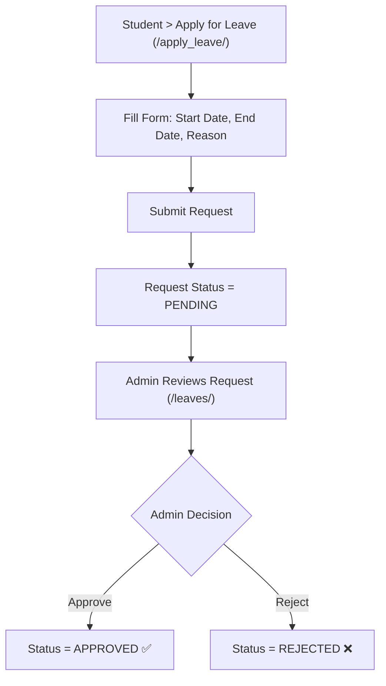
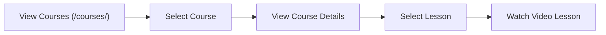

# 🎓 Student — Complete Workflow

## Step 1: Registration & Account Creation
> **Note:** Students cannot register themselves. An Admin must register them.

1. Admin goes to `/register/`.
2. Admin enters the student's Name, Roll No, Semester, Department, and Session.
3. Admin uploads a clear photo of the student's face.
4. The system's **FaceNet AI** extracts the face encoding and saves it.
5. A **Django User Account** is automatically created for the student.

---

## Step 2: Student Login
```
URL: http://127.0.0.1:8000/login/
```
Students log in using the credentials created during registration (usually their username/roll number).
- Upon successful login, the system detects they are not staff (`is_staff=False`) and redirects them to the **Student Dashboard** (`/student-dashboard/`).

---

## Step 3: Student Dashboard (Home Screen)
```
URL: http://127.0.0.1:8000/student-dashboard/
```
From the dashboard, students can access 4 main areas:
1. 📊 My Attendance
2. 💰 My Fees
3. 📝 Leave Management
4. 📚 My Courses

---

## 📋 Feature-wise Detailed Workflow

### 🟢 A. Automated Attendance (No Action Required by Student)
Students **do not** mark their own attendance manually. 
- When they walk into the classroom, the Admin/Teacher starts the camera (`/mark-attendance/`).
- The camera detects the student's face in real-time.
- Attendance is automatically marked as **PRESENT** in the database.

### 🟢 B. View Attendance History
```
URL: http://127.0.0.1:8000/student-attendance/
```
Students can track their own attendance records.
- They see a list of dates and their status (**Present, Absent, or Late**).
- They cannot modify this data.

---

### 🟢 C. Fee Details
```
URL: http://127.0.0.1:8000/student-fee-detail/
```
Students can check their fee status:
- Total Fee Amount assigned to them.
- Amount Paid so far.
- Pending Balance.

---

### 🟢 D. Leave Management
Students can apply for leave if they will be absent.



Students can track the status of their leave applications at:
- **My Leaves List:** `/Student_leave_list/`

---

### 🟢 E. Browse Courses & Lessons
```
URL: http://127.0.0.1:8000/courses/
```
Students have access to an e-learning portal where they can watch recorded lessons submitted by the admin/teachers.



---

## 🚀 Proposed "Teacher" Workflow (If you want to build it)
Since there is no "Teacher" role right now, if you want to add one, here is how we can structure it:

1. **Role Creation:** Add a `is_teacher` flag to the User model, or a `Teacher` profile model.
2. **Teacher Dashboard:** Teachers would log in and see courses/students assigned to them.
3. **Permissions:**
   - ✅ Can start the camera to mark face attendance for their specific class.
   - ✅ Can upload lessons/videos to their assigned courses.
   - ✅ Can view attendance reports for their department/semester.
   - ❌ Cannot manage fees (Admin only).
   - ❌ Cannot change global settings (Admin only).
