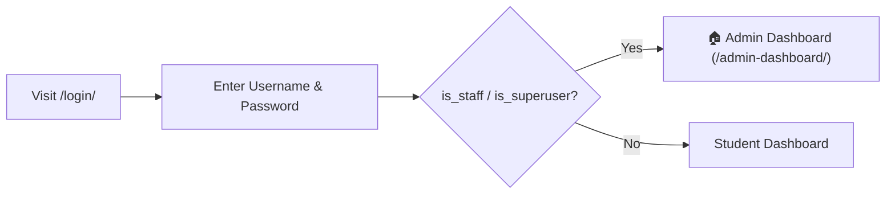
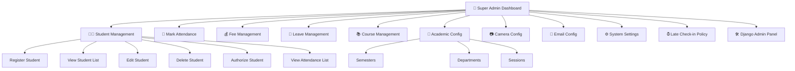
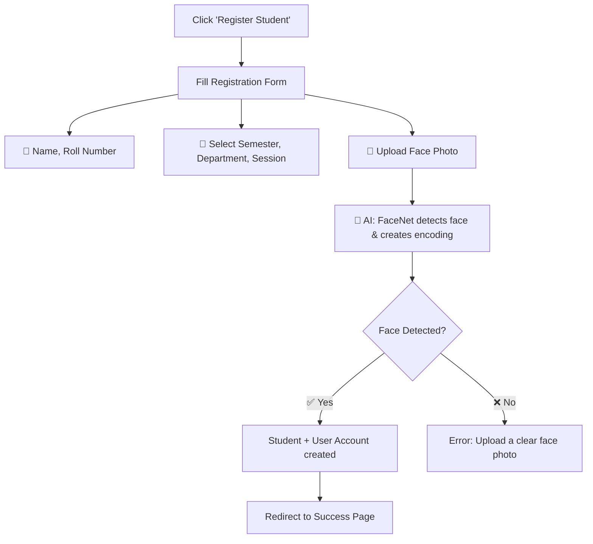
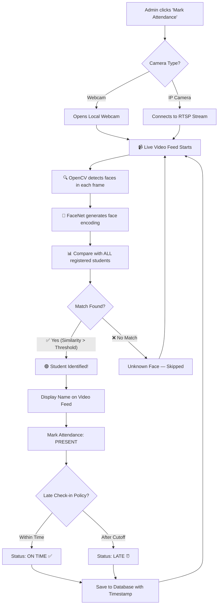
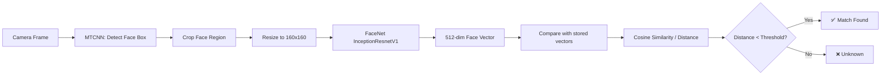
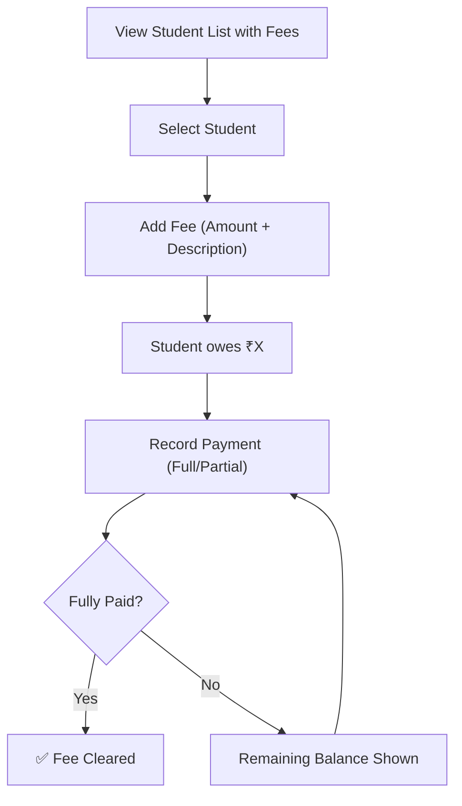
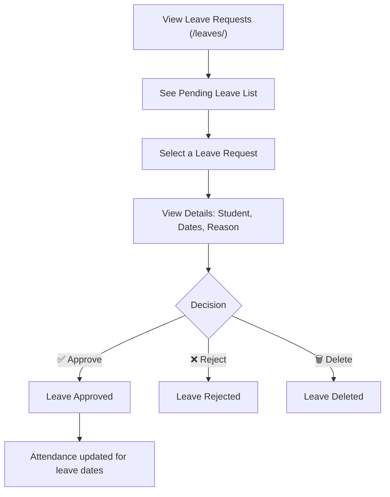
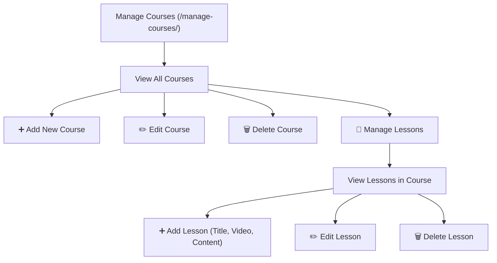
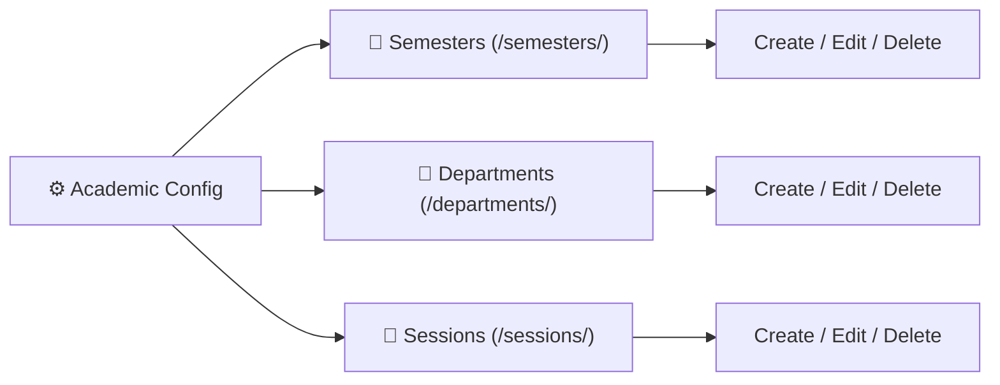
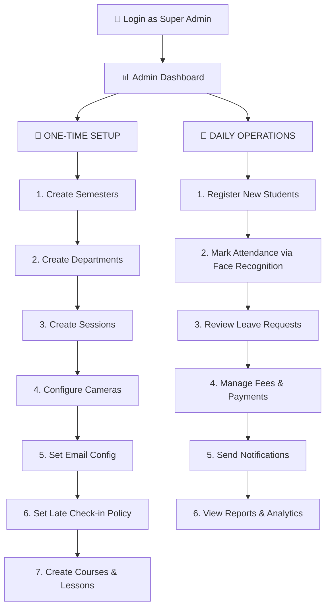

# 🔑 Super Admin — Complete Workflow

## Step 1: Login
```
URL: http://127.0.0.1:8000/login/
Credentials: superuser username + password
```



---

## Step 2: Admin Dashboard (Home Screen)

```
URL: http://127.0.0.1:8000/admin-dashboard/
```

The dashboard shows **live analytics** at a glance:

| Metric | Description |
|---|---|
| 📊 Total Students | Count of all registered students |
| ✅ Total Attendance | All attendance records |
| 🟢 Present Today | Students present today |
| 🔴 Absent Today | Students absent today |
| ⏰ Late Today | Late check-ins today |
| 📷 Total Cameras | Configured cameras |
| 💰 Pending Fees | Students with unpaid fees |

---

## Step 3: All Admin Functions



---

## 📋 Feature-wise Detailed Workflow

### 🟢 A. Student Registration

```
URL: http://127.0.0.1:8000/register/
```



> [!IMPORTANT]
> The uploaded photo must have a **clear, front-facing face**. The AI model (FaceNet) extracts a 512-dimensional face vector that is stored for future recognition.

---

### 🟢 B. Student List & Management

| Action | URL | What it does |
|---|---|---|
| **View All Students** | `/student-list/` | Shows all registered students |
| **Student Details** | `/student/<id>/` | Full profile + attendance history |
| **Edit Student** | `/student-edit/<id>/` | Update name, department, photo, etc. |
| **Delete Student** | `/student-delete/<id>/` | Remove student & their data |
| **Authorize Student** | `/student-authorize/<id>/` | Verify/authorize a student |
| **Attendance List** | `/student-attendance-list/` | View all attendance records |

---

### 🟢 C. 📸 Mark Attendance (Face Recognition — CORE)

```
URL: http://127.0.0.1:8000/mark-attendance/
```



**How the AI works internally:**



---

### 🟢 D. Fee Management

| Action | URL | What it does |
|---|---|---|
| **Student List with Fees** | `/student-list-with-fees/` | All students + fee status |
| **Add Fee** | `/add-fee/<student_id>/` | Assign new fee to student |
| **Record Payment** | `/pay-fee/<student_id>/` | Record a fee payment |
| **Fee Details** | `/student-fee-details/<student_id>/` | View complete fee history |
| **Delete Payment** | `/delete-fee-payment/<id>/` | Remove a payment record |
| **Mark as Paid** | `/mark-fee-as-paid/<fee_id>/` | Manually mark fee as paid |



---

### 🟢 E. Leave Management (`is_superuser` required)

```
URL: http://127.0.0.1:8000/leaves/
```

> [!IMPORTANT]
> Leave management requires **`is_superuser = True`**. Regular staff cannot approve/reject leaves.



| Action | URL | Access |
|---|---|---|
| View All Leaves | `/leaves/` | Superuser only |
| Approve Leave | `/leaves/<id>/approve/` | Superuser only |
| Reject Leave | `/leaves/<id>/reject/` | Superuser only |
| Delete Leave | `/leaves/<id>/delete/` | Superuser only |

---

### 🟢 F. Course & Lesson Management (`is_staff` required)



| Action | URL |
|---|---|
| Manage Courses | `/manage-courses/` |
| Add Course | `/add-course/` |
| Edit Course | `/edit-course/<id>/` |
| Delete Course | `/delete-course/<id>/` |
| Manage Lessons | `/manage-lessons/<course_id>/` |
| Add Lesson | `/add-lesson/<course_id>/` |
| Edit Lesson | `/edit-lesson/<id>/` |
| Delete Lesson | `/delete-lesson/<id>/` |

---

### 🟢 G. Academic Configuration (CRUD)



| Module | List URL | Create | Edit | Delete |
|---|---|---|---|---|
| Semester | `/semesters/` | `/semesters/create/` | `/semesters/<pk>/update/` | `/semesters/<pk>/delete/` |
| Department | `/departments/` | `/departments/create/` | `/departments/<pk>/update/` | `/departments/<pk>/delete/` |
| Session | `/sessions/` | `/sessions/create/` | `/sessions/<pk>/update/` | `/sessions/<pk>/delete/` |

---

### 🟢 H. Camera Configuration

```
URL: http://127.0.0.1:8000/camera-config/
```

| Action | URL |
|---|---|
| View Cameras | `/camera-config/` |
| Add Camera | `/camera-config/create/` |
| Edit Camera | `/camera-config/update/<id>/` |
| Delete Camera | `/camera-config/delete/<id>/` |

> [!TIP]
> Configure IP cameras here (RTSP URL, camera name, location). These are used during attendance marking with the "IP Camera" option.

---

### 🟢 I. Email Configuration

| Action | URL |
|---|---|
| View Email Configs | `/email-configs/` |
| Add Config | `/add-email-config/` |
| Edit Config | `/edit-email-config/<id>/` |
| Delete Config | `/delete-email-config/<id>/` |

Used for **sending attendance notifications** to parents/students via email.

---

### 🟢 J. System Settings

```
URL: http://127.0.0.1:8000/settings/
```

| Action | URL |
|---|---|
| View Settings | `/settings/` |
| Create Setting | `/settings/create/` |
| Edit Setting | `/settings/<pk>/update/` |
| Delete Setting | `/settings/<pk>/delete/` |

---

### 🟢 K. Late Check-in Policies

```
URL: http://127.0.0.1:8000/late-checkin-policies/
```

Define rules for what counts as "late" attendance (e.g., after 9:15 AM = Late).

---

### 🟢 L. Django Admin Panel

```
URL: http://127.0.0.1:8000/admin/
```

> [!NOTE]
> Only **Superusers** can access the Django Admin Panel. This gives raw database access to all 15 models — useful for debugging and advanced management.

---

## 📧 Send Attendance Notifications

```
URL: http://127.0.0.1:8000/send-notifications/
Access: Staff only
```

Sends email notifications about attendance to configured recipients.

---

## 🗺️ Complete Super Admin Journey Map



---

## 🔑 Access Control Summary

| Feature | `is_staff` | `is_superuser` |
|---|---|---|
| Admin Dashboard | ✅ | ✅ |
| Student Management | ✅ | ✅ |
| Mark Attendance | ✅ | ✅ |
| Course Management | ✅ | ✅ |
| Fee Management | ✅ | ✅ |
| Send Notifications | ✅ | ✅ |
| **Leave Approve/Reject** | ❌ | ✅ |
| **Leave Delete** | ❌ | ✅ |
| **Django Admin Panel** | ❌ | ✅ |
